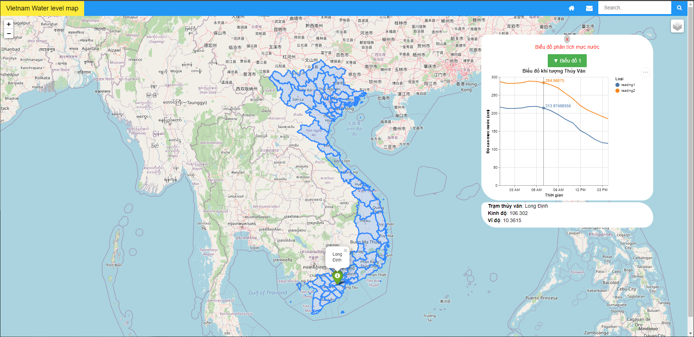

# Web Based Map using Folium

## Installation
- git clone https://github.com/kaylode/web-based-map.git
- cd web-based-map
- pip install -r requirements.txt

## How to run

- Install PostgreSQL
- Download postgresql from https://www.postgresql.org/download/
- Install both PostgreSQL Server and pgAdmin

- Run the app
```
python app.py
```

- Go to server: http://127.0.0.1:5000/
- To crawl data and save to database: http://127.0.0.1:5000/request

## Water Level API

- To get data, call API:
```
http://157.245.207.139:8000/api/{camera_id}/history?time={datetime}
```
- Parameters:
  - camera_id = {tvlongdinh, tvmytho}
  - datetime = "%Y-%m-%d-%H-%M-%S"
    

- Json returns
```
{
  "CameraId": {camera_id},
  "Timestamp": "%Y-%m-%dT%H-%M-%S",
  "FTPLink": "...",
  "Reading": {value1},
  "Reading2": {value2},
}
```

## Visualization




## References
- https://github.com/python-visualization/folium
- https://vega.github.io/vega-lite/examples/
