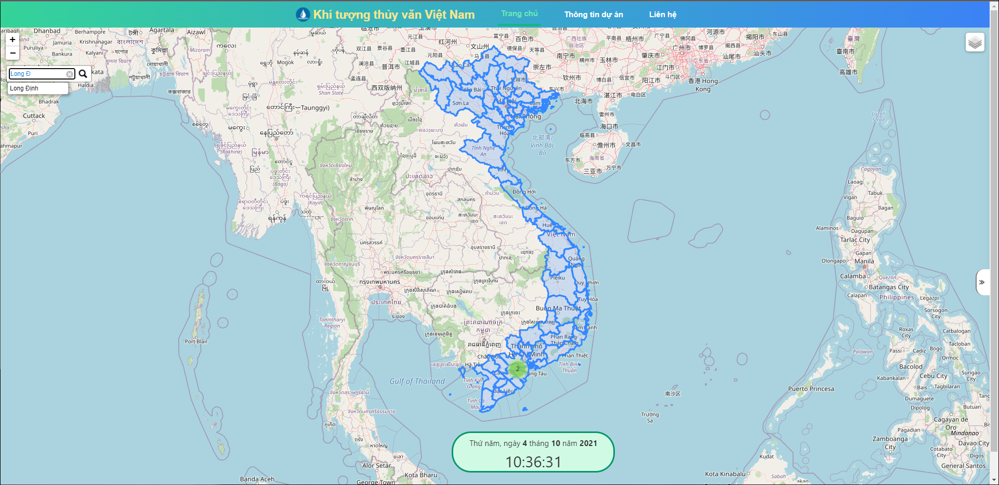
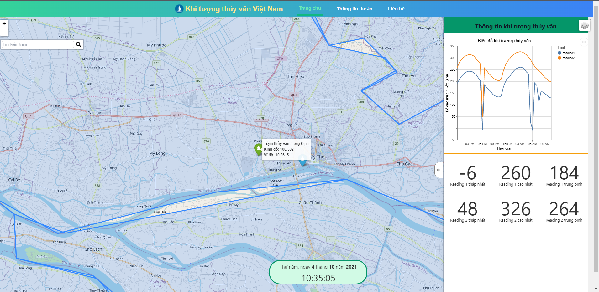

# Vietnam Hydrometeorology Observation Map

## **Installation**

- Download and install postgresql from https://www.postgresql.org/download/
- git clone https://github.com/kaylode/web-based-map.git
- cd web-based-map
- pip install -r requirements.txt

## **How to run**

### **Initialize database**
- This repo uses PostgreSQL as Database server 

- Connect to PostgreSQL server:
```
psql -U <username>;
```

- Create database: 
```
create database <tablename>;
```

- Create table: 
```
\c <tablename> # connect to database
create table waterlevel;
```

- Check if table exists:
```
\dt
```

### **Start server**
- Configure the server using ```configs/configs.yaml```
- Run server
```
cd src
python app.py
```
- Go to host: http://192.168.100.9:5000/, server will automatically request data from API server when initiated

## **Visualization**



## **References**
- https://github.com/python-visualization/folium
- https://vega.github.io/vega-lite/examples/
- https://www.postgresqltutorial.com/postgresql-python/
- https://tailwindcss.com/docs
